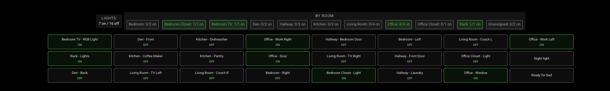
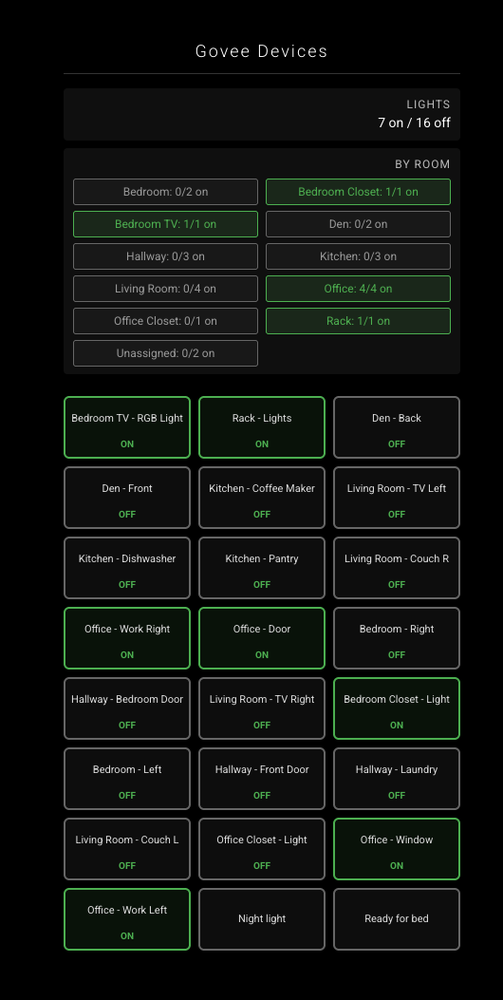

# MMM-GoveeSmartHomeStatus

A MagicMirror module for displaying Govee smart home device status and information.

[](https://github.com/rroach3753/MMM-GoveeSmartHomeStatus/tags)
[](https://github.com/rroach3753/MMM-GoveeSmartHomeStatus/blob/main/LICENSE)

**Repository:** [github.com/rroach3753/MMM-GoveeSmartHomeStatus](https://github.com/rroach3753/MMM-GoveeSmartHomeStatus)

## Features

- Display list of Govee smart devices with live online and power state
- Display temperature and humidity when the device reports them
- Color-coded online/offline status indicators
- Source badges for connectivity path: `CLOUD`, `LAN`, and `LAN+`
- Real-time device list updates
- Refreshes update in place after the first render without flashing the module
- Configurable refresh interval
- Full-width bottom bar layout option for compact device display
- **Compact multi-column card grid layout** with 3-4 cards per row (ideal for side panels)
- Compact cards sorted by room name, then device name
- Lights summary showing on/off counts for detected lights
- Room summary showing on/total devices by room
- Customizable light detection keywords
- Appliance hiding with configurable keyword filters (enabled by default)
- Optional LAN Control discovery for local-network device visibility
- **Homebridge power consumption integration** — display live wattage on outlet cards sourced from the Homebridge REST API

## Requirements

- MagicMirror² installed and running
- A Govee account with supported devices
- A Govee Open API key (required for cloud or hybrid modes)
- Outbound HTTPS access to `openapi.api.govee.com`

For LAN Control mode:

- Enable LAN Control for each device in the Govee app
- Keep MagicMirror and Govee devices on the same local network/VLAN, or use cross-subnet targeting options below
- Allow local UDP multicast/broadcast discovery traffic

**Note:** This module now calls both Govee APIs: the device list endpoint and the per-device state endpoint. With large device counts, lower refresh intervals will consume your daily API quota faster.

## Installation

### Install (Standard / Git)

1. Navigate to your MagicMirror modules directory:

   ```bash
   cd ~/MagicMirror/modules
   ```

2. Clone the repository from [GitHub](https://github.com/rroach3753/MMM-GoveeSmartHomeStatus):

   ```bash
   git clone https://github.com/rroach3753/MMM-GoveeSmartHomeStatus.git
   ```

3. Navigate into the module directory:

   ```bash
   cd MMM-GoveeSmartHomeStatus
   ```

4. Install dependencies:

   ```bash
   npm install
   ```

### Install (MMPM)

1. Install using MMPM:

   ```bash
   mmpm install MMM-GoveeSmartHomeStatus
   ```

2. If your setup requires dependencies to be installed manually, run:

   ```bash
   cd ~/MagicMirror/modules/MMM-GoveeSmartHomeStatus
   npm install
   ```

## Updating

### Update (Standard / Git)

1. Navigate to the module directory:

   ```bash
   cd ~/MagicMirror/modules/MMM-GoveeSmartHomeStatus
   ```

2. Pull the latest changes:

   ```bash
   git pull
   ```

3. Refresh dependencies (recommended after updates):

   ```bash
   npm install
   ```

### Update (MMPM)

```bash
mmpm update MMM-GoveeSmartHomeStatus
```

## Govee API Key (Required)

This module requires a Govee Open API key. Without it, device data cannot be loaded.

If you configure `enableLanControl: true` and `lanOnly: true`, you can run LAN discovery mode without an API key.

LAN-only mode is currently discovery-focused. Some devices may not report cloud-level telemetry fields (for example, power/temperature/humidity) unless cloud mode is also enabled.

Fallback behavior:

- In hybrid mode (`enableLanControl: true`, `lanOnly: false`), if LAN `devStatus` is unavailable for a device, the module keeps cloud state for that device.
- In LAN-only mode (`lanOnly: true`), there is no cloud fallback.

### How to get a key

1. Create or sign in to your Govee account at [https://www.govee.com/](https://www.govee.com/).
2. Go to the Govee developer portal at [https://developer.govee.com/](https://developer.govee.com/) and apply for Open API access.
3. After approval, create/generate your API key from your Govee developer settings.
4. Add the key to your MagicMirror module config:

```javascript
config: {
   apiKey: "YOUR_GOVEE_API_KEY"
}
```

### Alternative: get API key in the Govee mobile app

If you prefer, you can request/generate your API key directly in the Govee app:

1. Open the Govee Home app and sign in.
2. Go to **Profile**.
3. Open **About Us**.
4. Tap **Apply for API Key** (or **Request API Key**, depending on app version).
5. Submit the request and copy the generated key once approved/available.
6. Paste that key into your module config (`apiKey: "YOUR_GOVEE_API_KEY"`).

If you do not see the API key option in-app, update the app to the latest version and check the developer portal method above.

## Basic Config Example (Quick Start)

Add this module block to your MagicMirror `config/config.js` file to get started:

1. Install the module in your `MagicMirror/modules` folder.
2. Add this module block to the modules array in `config/config.js`.
3. Save and restart MagicMirror.

```javascript
{
  module: "MMM-GoveeSmartHomeStatus",
  position: "top_right",
  config: {
    apiKey: "YOUR_GOVEE_API_KEY",
    title: "Govee Devices",
    refreshInterval: 480000,           // Refresh every 8 minutes (ms)
    showOnlineOnly: false,             // Show all devices or only online
    showPower: true,                   // Display live power state when available
    showTemperature: true,             // Display live temperature when available
    showHumidity: true,                // Display live humidity when available
    showLightsSummary: true,           // Show lights count summary
    showRoomSummary: true,             // Show per-room summary
    roomSummaryLightsOnly: false,      // Include all devices in room summary
    lightDetectionKeywords: ["light", "lamp", "bulb", "strip", "led"],
    hideAppliances: true,              // Hide appliance devices by keyword
    hiddenApplianceKeywords: ["ice maker", "icemaker", "refrigerator", "fridge"],
    roomNameDelimiter: " - ",          // Room parsing from device names (e.g. "Kitchen - Lamp")
    enableLanControl: false,
    lanOnly: false,
    lanDiscoveryTimeout: 4000,
    lanDiscoveryTargets: [],            // Optional IPv4/CIDR targets for unicast LAN scan probes
    lanStaticDevices: [],               // Optional static LAN devices for cross-subnet fallback
    cloudDeviceListRefreshInterval: 0,  // 0 = fetch cloud device list every module refresh
    cloudDeviceStateRefreshInterval: 0, // 0 = fetch cloud state every module refresh
    compactCards: false,
    maxCompactCards: 12,
    fullWidthBottomBar: false,
    homebridgeUrl: "",                  // Optional: Homebridge UI URL, e.g. "http://192.168.1.50:8581"
    homebridgeUsername: "",             // Optional: Homebridge UI username
    homebridgePassword: "",             // Optional: Homebridge UI password
    showPowerConsumption: true,         // Show live wattage from Homebridge when available
    emptyMessage: "No devices available.",
    loadingMessage: "Loading Govee devices...",
    noApiKeyMessage: "API key not configured.",
    errorMessage: "Error fetching Govee device data."
  }
},
```

Then restart MagicMirror.

## Configuration Options

| Option | Type | Description | Default |
| -------- | ------ | ------------- | --------- |
| `apiKey` | String | Your Govee API key (required) | `""` |
| `title` | String | Module title | `"Govee Devices"` |
| `refreshInterval` | Number | Refresh interval in milliseconds (0 to disable) | `480000` |
| `showOnlineOnly` | Boolean | Show only devices currently reporting online | `false` |
| `showPower` | Boolean | Display live power state when available | `true` |
| `showTemperature` | Boolean | Display live temperature when available | `true` |
| `showHumidity` | Boolean | Display live humidity when available | `true` |
| `showLightsSummary` | Boolean | Show total lights count summary | `true` |
| `showRoomSummary` | Boolean | Show per-room on/total summary | `true` |
| `roomSummaryLightsOnly` | Boolean | Limit room summary counts to light devices | `false` |
| `lightDetectionKeywords` | Array | Case-insensitive keywords used to classify devices as lights | `['light', 'lamp', 'bulb', 'strip', 'led']` |
| `hideAppliances` | Boolean | Hide appliance-like devices from display | `true` |
| `hiddenApplianceKeywords` | Array | Case-insensitive keywords used to hide appliances | `['ice maker', 'icemaker', 'refrigerator', 'fridge']` |
| `roomNameDelimiter` | String | Delimiter used to infer room from device name | `' - '` |
| `enableLanControl` | Boolean | Enable LAN discovery in addition to cloud API | `false` |
| `lanOnly` | Boolean | Use LAN discovery only (no API key required) | `false` |
| `lanDiscoveryTimeout` | Number | LAN discovery timeout in milliseconds | `4000` |
| `lanDiscoveryTargets` | Array | Optional IPv4 and CIDR target list for unicast LAN discovery probes (for cross-subnet/VLAN environments) | `[]` |
| `lanStaticDevices` | Array | Optional static LAN device list merged with discovered devices | `[]` |
| `cloudDeviceListRefreshInterval` | Number | Cloud device-list refresh interval in milliseconds. `0` keeps legacy behavior (every module refresh). | `0` |
| `cloudDeviceStateRefreshInterval` | Number | Cloud device-state refresh interval in milliseconds. `0` keeps legacy behavior (every module refresh). | `0` |
| `compactCards` | Boolean | Display devices as compact horizontal cards (scrollable) | `false` |
| `maxCompactCards` | Number | Maximum number of devices to show in compact card view | `12` |
| `emptyMessage` | String | Message when no devices available | `"No devices available."` |
| `loadingMessage` | String | Loading message | `"Loading Govee devices..."` |
| `noApiKeyMessage` | String | Message when API key not configured | `"API key not configured."` |
| `errorMessage` | String | Error message | `"Error fetching Govee device data."` |
| `fullWidthBottomBar` | Boolean | Span full width of bottom_bar position | `false` |
| `homebridgeUrl` | String | Homebridge config-ui-x base URL (e.g. `"http://192.168.1.50:8581"`). Leave empty to disable. | `""` |
| `homebridgeUsername` | String | Homebridge UI username | `""` |
| `homebridgePassword` | String | Homebridge UI password | `""` |
| `showPowerConsumption` | Boolean | Show live wattage sourced from Homebridge when available | `true` |

## Usage Examples

### Standard Layout (Top Right Position)

```javascript
{
   module: "MMM-GoveeSmartHomeStatus",
   position: "top_right",
   config: {
      apiKey: "YOUR_GOVEE_API_KEY",
      title: "Govee Devices"
   }
},
```

### Full-Width Bottom Bar Layout

```javascript
{
   module: "MMM-GoveeSmartHomeStatus",
   position: "bottom_bar",
   config: {
      apiKey: "YOUR_GOVEE_API_KEY",
      fullWidthBottomBar: true,
      showTemperature: false,
      showHumidity: false
   }
},
```

### Disable Summaries and Show Appliances

```javascript
{
   module: "MMM-GoveeSmartHomeStatus",
   position: "top_right",
   config: {
      apiKey: "YOUR_GOVEE_API_KEY",
      showLightsSummary: false,
      showRoomSummary: false,
      hideAppliances: false
   }
},
```

### Hybrid Cloud + LAN Discovery (Recommended)

```javascript
{
   module: "MMM-GoveeSmartHomeStatus",
   position: "top_right",
   config: {
      apiKey: "YOUR_GOVEE_API_KEY",
      enableLanControl: true,
      lanOnly: false,
      lanDiscoveryTimeout: 4000
   }
},
```

### LAN-Only Discovery (No API Key)

```javascript
{
   module: "MMM-GoveeSmartHomeStatus",
   position: "top_right",
   config: {
      enableLanControl: true,
      lanOnly: true,
      lanDiscoveryTimeout: 5000
   }
},
```

Tip: Use hybrid mode (`enableLanControl: true` with `lanOnly: false`) if you want LAN reachability plus richer cloud state data.

### Hybrid Mode with Segmented Cloud Refresh

```javascript
{
   module: "MMM-GoveeSmartHomeStatus",
   position: "top_right",
   config: {
      apiKey: "YOUR_GOVEE_API_KEY",
      refreshInterval: 120000,                 // Module refresh every 2 minutes
      enableLanControl: true,
      lanOnly: false,
      cloudDeviceListRefreshInterval: 1800000, // Device list every 30 minutes
      cloudDeviceStateRefreshInterval: 120000  // Device state every 2 minutes
   }
},
```

With segmented refresh enabled, set `refreshInterval` to your fastest desired update cadence (usually the cloud state interval).

### Recommended: Fast LAN + Conservative Cloud

```javascript
{
   module: "MMM-GoveeSmartHomeStatus",
   position: "bottom_bar",
   config: {
      apiKey: "YOUR_GOVEE_API_KEY",
      compactCards: true,
      maxCompactCards: 30,
      showRoomSummary: true,
      showLightsSummary: true,
      refreshInterval: 30000,                   // UI/LAN cadence every 30s
      enableLanControl: true,
      lanOnly: false,
      lanDiscoveryTimeout: 5000,
      lanDiscoveryTargets: ["10.0.10.0/24"],
      cloudDeviceListRefreshInterval: 28800000, // Cloud list every 8h
      cloudDeviceStateRefreshInterval: 600000   // Cloud state every 10m
   }
},
```

This profile keeps local card responsiveness high while reducing cloud API calls.

### Cross-Subnet / VLAN Discovery

```javascript
{
   module: "MMM-GoveeSmartHomeStatus",
   position: "top_right",
   config: {
      apiKey: "YOUR_GOVEE_API_KEY",
      enableLanControl: true,
      lanOnly: false,
      lanDiscoveryTimeout: 5000,
      lanDiscoveryTargets: ["10.0.10.0/28", "10.0.10.97", "10.0.10.101"],
      lanStaticDevices: [
         {
            ip: "10.0.10.63",
            deviceId: "05:36:5C:E7:53:E8:F7:24",
            deviceName: "Kitchen Strip",
            model: "H1401"
         },
         {
            ip: "10.0.10.97",
            deviceId: "04:6E:5C:E7:53:CE:51:0E",
            deviceName: "Desk Lamp",
            model: "H1401"
         }
      ]
   }
},
```

`lanDiscoveryTargets` accepts individual IPv4 addresses and CIDR ranges, and sends unicast scan packets to the expanded IP list in addition to multicast/broadcast.

For safety, CIDR expansion is capped at 512 unicast targets per refresh cycle.

`lanStaticDevices` adds known devices even when cross-subnet UDP replies are blocked.

### Compact Cards Layout with Room Summaries

```javascript
{
   module: "MMM-GoveeSmartHomeStatus",
   position: "bottom_right",
   config: {
      apiKey: "YOUR_GOVEE_API_KEY",
      compactCards: true,
      maxCompactCards: 12,
      showRoomSummary: true,
      showLightsSummary: true
   }
},
```

### Homebridge Power Consumption (Outlet Wattage)

Display live wattage on outlet device cards by connecting to the Homebridge REST API. Homebridge-Govee receives real-time power data from the outlet via its AWS IoT channel and exposes it as a `CurrentConsumption` Eve characteristic. This module reads that value on each refresh.

The device name in Homebridge must match the Govee device name in your app **exactly** (case-insensitive). No additional Homebridge plugins are required — only the built-in config-ui-x REST API.

```javascript
{
   module: "MMM-GoveeSmartHomeStatus",
   position: "top_right",
   config: {
      apiKey: "YOUR_GOVEE_API_KEY",
      homebridgeUrl: "http://192.168.1.50:8581",
      homebridgeUsername: "admin",
      homebridgePassword: "yourpassword",
      showPowerConsumption: true
   }
},
```

If Homebridge is unreachable or returns an error the Govee devices still display normally; the wattage value is simply omitted.

## Screenshots

### Bottom Bar Layout



In this layout:

- Summaries are centered horizontally above device cards
- Lights and room summaries render in a horizontal row
- Device cards are compact and fit into a maximum of 2 rows

### Side Panel Layout (Bottom Right)



This layout displays:

- **Lights Summary** — Total count of lights on/off (e.g., "7 on / 16 off")
- **Room Summary** — 2-column grid showing per-room device counts with color-coding:
  - Green border/text for rooms with at least one device ON
  - Gray border/text for rooms with all devices OFF
- **Device Grid** — Compact 3-column card layout showing all devices with name and power state (ON/OFF)
  - Green border indicates powered ON devices
  - Gray border indicates powered OFF devices
  - Source badge shows `LAN+` (cloud+LAN merged), `LAN` (LAN-only), or `CLOUD` (cloud-only)
  - Perfect for side panels (bottom_right, top_right, etc.)

## Customizing Light Detection

The module classifies a device as a light when its name, type, or model contains a keyword from `lightDetectionKeywords`. This is used for the lights summary and for detecting light devices in room summaries.

### Example: Add custom light keywords

```javascript
{
   module: "MMM-GoveeSmartHomeStatus",
   position: "top_right",
   config: {
      apiKey: "YOUR_GOVEE_API_KEY",
      lightDetectionKeywords: ["light", "lamp", "bulb", "strip", "led", "sconce", "can", "uplight"]
   }
},
```

### Example: Strict light matching (only certain types)

```javascript
{
   module: "MMM-GoveeSmartHomeStatus",
   position: "top_right",
   config: {
      apiKey: "YOUR_GOVEE_API_KEY",
      lightDetectionKeywords: ["bulb", "strip"]
   }
},
```

## Troubleshooting

### DNS Resolution Error: "getaddrinfo ENOTFOUND api.govee.com"

This error indicates your system cannot reach the Govee API server. Try these steps:

1. **Check Network Connectivity**

   ```bash
   ping -c 4 openapi.api.govee.com
   nslookup openapi.api.govee.com
   ```

2. **Check Firewall/Network Access**
   - Ensure your network allows HTTPS (port 443) outbound connections
   - Check if your ISP or network is blocking access to openapi.api.govee.com
   - Try disabling VPN or proxy if you're using one

3. **Verify DNS Configuration**

   ```bash
   cat /etc/resolv.conf
   ```

   Ensure you have valid DNS servers configured (e.g., 8.8.8.8, 1.1.1.1)

4. **Test API Connectivity**

   ```bash
   curl -H "Govee-API-Key: YOUR_API_KEY" https://openapi.api.govee.com/router/api/v1/user/devices
   ```

### Invalid API Key Error

- Verify your API key is correct in config.js
- Check that there are no extra spaces or quotes around the key
- Regenerate your API key from the Govee app if unsure

### No Devices Displayed

- Verify you have Govee devices added to your account
- Ensure the devices are online and connected to WiFi
- Check that your API key has permissions to access device data
- If `hideAppliances` is enabled, appliance-like names such as `ice maker` or `fridge` may be filtered out intentionally

### API Usage Notes

- The module calls the device list endpoint once per refresh plus one state request per returned device
- Example: 25 devices with an 8 minute refresh interval is about 4,680 requests per day
- Govee documents a 10,000 request per account per day limit, so avoid very short refresh intervals on larger device lists

### API Budget Calculator

If you use the default behavior, each cloud refresh makes:

`1 + device_count`

cloud requests, where `device_count` is the number of devices returned by the cloud device list.

If you enable segmented refresh, the rough daily request count is:

`(list_refreshes_per_day * 1) + (state_refreshes_per_day * device_count)`

For example, with 25 devices, a 30 minute device-list interval, and a 2 minute device-state interval:

- Device list calls per day: `24`
- Device state calls per day: `25 * 720 = 18,000`
- Total cloud requests per day: `18,024`

That is a high-volume configuration and will exceed the 10,000 request limit.

| Mode | Example intervals | Rough requests/day | Notes |
| ------ | ------------------- | -------------------- | ------- |
| Legacy | `refreshInterval = 8 min` | `25 devices -> 4,680` | Current behavior when both segmented intervals are `0` |
| Segmented, medium-use | `list = 30 min`, `state = 5 min` | `25 devices -> 7,224` | Balanced option that stays under the default limit |
| Segmented, fast | `list = 30 min`, `state = 2 min` | `25 devices -> 18,024` | Too high for the default Govee limit |
| Segmented, low-use | `list = 60 min`, `state = 10 min` | `25 devices -> 3,624` | Safer for larger device counts |

Backward compatibility note: if both `cloudDeviceListRefreshInterval` and `cloudDeviceStateRefreshInterval` are `0`, the module keeps the legacy behavior and refreshes both list and state on every module refresh.

### Safe Low-Use Segmented Refresh

```javascript
{
   module: "MMM-GoveeSmartHomeStatus",
   position: "top_right",
   config: {
      apiKey: "YOUR_GOVEE_API_KEY",
      refreshInterval: 600000,                // UI refresh every 10 minutes
      enableLanControl: true,
      lanOnly: false,
    cloudDeviceListRefreshInterval: 3600000, // Cloud device list every 60 minutes
    cloudDeviceStateRefreshInterval: 600000   // Cloud device state every 10 minutes
   }
},
```

This keeps the display responsive without hammering the cloud API. With 25 devices, it stays around `3,624` cloud requests/day.

### Medium-Use Segmented Refresh

```javascript
{
   module: "MMM-GoveeSmartHomeStatus",
   position: "top_right",
   config: {
      apiKey: "YOUR_GOVEE_API_KEY",
      refreshInterval: 300000,                // UI refresh every 5 minutes
      enableLanControl: true,
      lanOnly: false,
    cloudDeviceListRefreshInterval: 1800000, // Cloud device list every 30 minutes
    cloudDeviceStateRefreshInterval: 300000   // Cloud device state every 5 minutes
   }
},
```

This is a balanced option for moderate device counts. With 25 devices, it stays around `7,224` cloud requests/day.

## Dependencies

None. Uses only Node.js built-in modules (`https`, `dgram`).

## License

MIT

## Support & Contribution

For issues, feature requests, or contributions, please visit the [GitHub repository](https://github.com/rroach3753/MMM-GoveeSmartHomeStatus).

- [Issues](https://github.com/rroach3753/MMM-GoveeSmartHomeStatus/issues)
- [Discussions](https://github.com/rroach3753/MMM-GoveeSmartHomeStatus/discussions)
- [Pull Requests](https://github.com/rroach3753/MMM-GoveeSmartHomeStatus/pulls)
